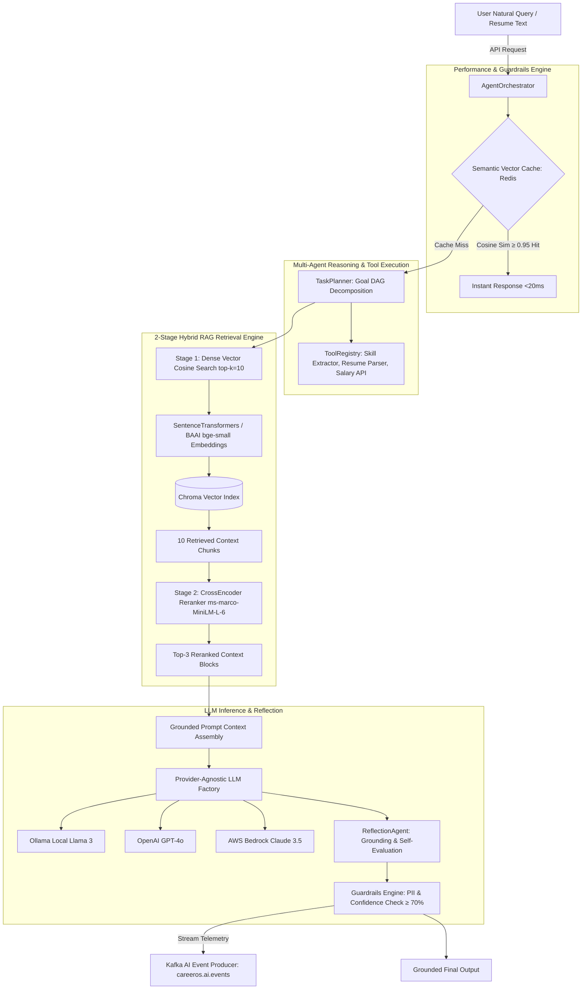
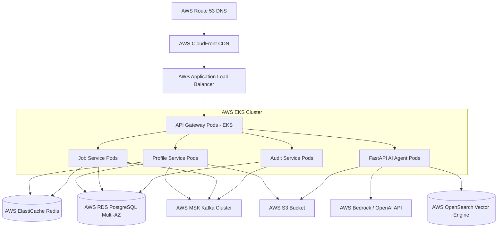

# CareerOS Platform - Enterprise Master Architecture Guide

## 1. System Overview & Architectural Principles
CareerOS is built using **Clean Architecture**, **Domain-Driven Design (DDD)**, and **SOLID Principles** to form an event-driven microservices platform.

### Core Architectural Guarantees:
1. **Decoupled Microservices**: Autonomous services built with Java 21 (Spring Boot 3) and Python 3.12 (FastAPI).
2. **Event-Driven Resilience**: Centralized event streaming over Apache Kafka with Idempotency checks and Dead Letter Queue (DLQ) fallbacks.
3. **Low-Latency Caching**: Cache-Aside pattern using Redis clusters for candidate profiles and vector semantic caches ($<20\text{ms}$).
4. **AI & 2-Stage RAG Capability**: Retrieval-Augmented Generation using LangChain, SentenceTransformers, Chroma Vector DB, and CrossEncoder reranking (`ms-marco-MiniLM-L-6-v2`).
5. **AWS Cloud Native**: Architected for AWS EKS, AWS MSK, AWS RDS PostgreSQL, AWS S3, and AWS Bedrock.

---

## 2. End-to-End Master System Topology

```mermaid
graph TD
    Client[React 19 Frontend :3000] -->|HTTPS REST / JWT| Gateway[Spring Cloud API Gateway :8080]
    Gateway -->|Eureka Discovery| Eureka[Eureka Service Registry :8761]
    
    subgraph Java Spring Boot Microservice Ecosystem
        Gateway --> Auth[Auth Service :8081]
        Gateway --> Profile[Profile Service :8082]
        Gateway --> Job[Job Service :8083]
        Gateway --> Notification[Notification Service :8084]
        Gateway --> Audit[Audit Service :8085]
        
        Profile -->|Read/Write| ProfileDB[(PostgreSQL - profile_db)]
        Job -->|Read/Write| JobDB[(PostgreSQL - job_db)]
        Auth -->|Read/Write| AuthDB[(PostgreSQL - auth_db)]
        Audit -->|Read/Write| AuditDB[(PostgreSQL - audit_db)]
        
        Profile -->|Cache| Redis[(Redis Cluster :6379)]
        Job -->|Cache| Redis
    end
    
    subgraph FastAPI Multi-Agent AI Microservice (:8000)
        Gateway -->|HTTP Routing /api/v1/ai| AIAgent[FastAPI Core Orchestrator]
        Job -->|Feign REST Client| AIAgent
        
        AIAgent --> Planner[TaskPlanner & ToolRegistry]
        AIAgent --> RAG[2-Stage RAG Pipeline]
        AIAgent --> SemanticCache[Vector Semantic Cache: Redis]
        
        RAG --> Embeddings[SentenceTransformers all-MiniLM-L6-v2]
        Embeddings --> Chroma[(Chroma Vector DB)]
        RAG --> CrossEncoder[CrossEncoder Reranker ms-marco-MiniLM-L-6]
        
        AIAgent --> LLMFactory[LLM Provider Factory]
        LLMFactory --> LocalOllama[Ollama Local Llama 3]
        LLMFactory --> OpenAI[OpenAI GPT-4o]
        LLMFactory --> Bedrock[AWS Bedrock Claude 3.5]
    end
    
    subgraph Event Streaming & Messaging Pipelines
        Auth -->|Publish USER_REGISTERED| Kafka[Apache Kafka :9092]
        Profile -->|Publish PROFILE_UPDATED| Kafka
        Job -->|Publish JOB_APPLIED| Kafka
        AIAgent -->|Publish AI_EVENTS| Kafka
        
        Kafka -->|Consume Events| Audit
        Kafka -->|Consume Notifications| Notification
        Notification -->|Queue Notifications| RabbitMQ[RabbitMQ :5672]
        Notification -->|SMTP Email Sandbox| Mailpit[Mailpit :8025]
    end
```

---

## 3. AI Agent Microservice & 2-Stage RAG Architecture



---

## 4. AWS Cloud Deployment Blueprint (Production EKS Architecture)


