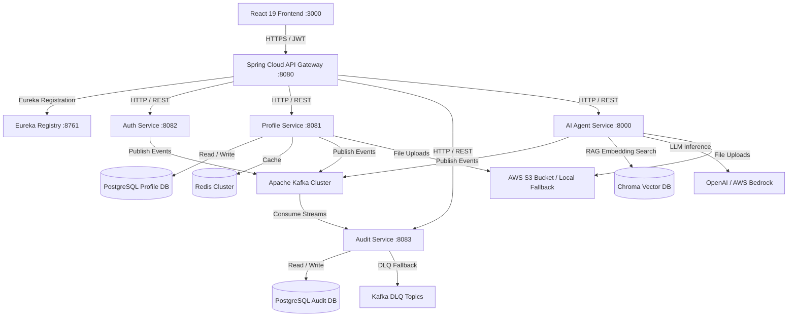
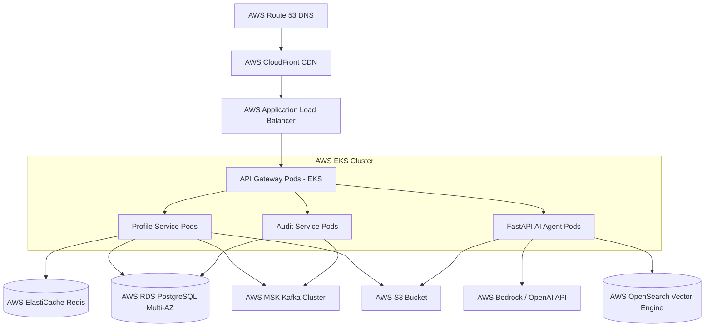

# CareerOS Platform - Enterprise Master Architecture Guide

## 1. System Overview & Architectural Principles
CareerOS is built using **Clean Architecture**, **Domain-Driven Design (DDD)**, and **SOLID Principles** to form an event-driven microservices platform.

### Core Architectural Guarantees:
1. **Decoupled Microservices**: Autonomous services built with Java 21 (Spring Boot 3) and Python 3.12 (FastAPI).
2. **Event-Driven Resilience**: Centralized event streaming over Apache Kafka with Idempotency checks and Dead Letter Queue (DLQ) fallbacks.
3. **Low-Latency Caching**: Cache-Aside pattern using Redis clusters for candidate profiles.
4. **AI & RAG Capability**: Retrieval-Augmented Generation using LangChain, OpenAI GPT-4o, and Chroma Vector DB.
5. **AWS Cloud Native**: Architected for AWS EKS, AWS MSK, AWS RDS PostgreSQL, AWS S3, and AWS Bedrock.

---

## 2. End-to-End Enterprise System Topology

---

## 3. Package & Layer Explanations Across All Microservices

### A. Core Architectural Layers
- **Controller / Router Layer**: Exposes REST HTTP endpoints, handles request validation (`@Valid` / Pydantic), and delegates to service layer.
- **Service Layer**: Implements core business logic, transactional boundaries (`@Transactional`), and event publishing.
- **Repository / Data Access Layer**: Manages database queries via Spring Data JPA specifications and raw SQL scripts.
- **DTO (Data Transfer Object) Layer**: Shields internal domain entities from external API contracts.
- **Mapper Layer**: Transforms domain entities into Response DTOs and vice versa.
- **Consumer Layer**: Asynchronously consumes Kafka event streams.
- **Producer / Event Layer**: Publishes domain events to Kafka topics.
- **Agent & Prompt Layer (AI)**: Encapsulates LLM prompt templates, RAG vector retrieval, and JSON output parsing.

---

## 4. Comprehensive Architectural Workflows

### A. Request & Security Flow
1. Client sends request with JWT `Authorization: Bearer <token>`.
2. API Gateway intercepts, validates JWT signature, and injects `X-User-Id` and `X-Correlation-Id` headers.
3. Target microservice processes request using context headers.

### B. Database & Transaction Flow
1. Flyway runs database migrations (`V1__init_schema.sql`) on startup.
2. Service methods execute inside `@Transactional` boundaries.
3. Optimistic Locking (`@Version`) prevents concurrent write conflicts.

### C. Kafka Event Streaming & Idempotency Flow
1. Microservice publishes domain event to Kafka topic.
2. `AuditKafkaConsumer` receives message.
3. Checks `existsByEventId(eventId)` index in PostgreSQL.
4. If duplicate -> Acknowledges offset & skips execution.
5. If new -> Saves audit log entity. If 3 failures occur -> Routes to `.DLQ` topic.

### D. AI & RAG Retrieval Flow
1. User requests career roadmap or ATS match score.
2. Candidate skills embedded via OpenAI embedding model.
3. Similar context retrieved from Chroma Vector DB using cosine distance.
4. Augmented prompt passed to GPT-4o -> Structured JSON response returned.

---

## 5. AWS Cloud Deployment Blueprint (Production EKS Architecture)

---

## 6. Future Tech Scope & ML Roadmap

CareerOS is architected to seamlessly integrate advanced AI/ML technologies without breaking existing service contracts:

| Technology | Integration Point in CareerOS | Future Capabilities |
| :--- | :--- | :--- |
| **LangGraph / Multi-Agent** | `AI-Agent/app/agents` | Autonomous multi-step resume rewriting graphs with reflection nodes. |
| **AWS Bedrock & SageMaker** | `AI-Agent/app/services` | Self-hosted Llama-3 fine-tuned candidate matching models. |
| **Vector DB (AWS OpenSearch)** | `AI-Agent/app/services` | Scale embedding storage to 10M+ candidates with hybrid sparse/dense search. |
| **Apache Spark & Airflow** | `audit-service` & `profile-service` | Batch ETL feature extraction from audit streams for offline ML model training. |
| **Voice AI (Whisper & ElevenLabs)**| `AI-Agent/app/api/v1/interview` | Real-time audio mock interviews with voice response scoring. |
| **OCR (AWS Textract)** | `profile-service` & `resume-service` | Automated PDF resume parsing and structured JSON extraction. |
