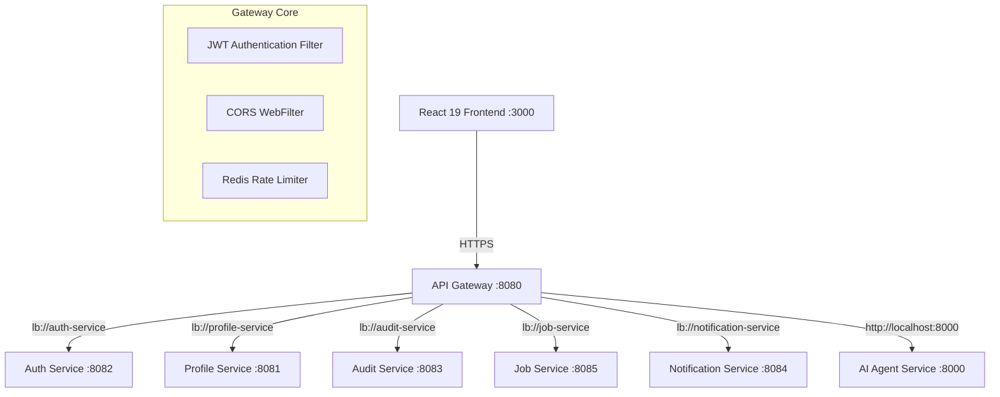

# API Gateway - Architecture & System Design Document

## 1. Overall System Architecture

## 2. Component Specifications

### A. Non-Blocking Event-Driven Core
- Built on Spring WebFlux & Project Reactor on Netty server.
- Zero thread blocking during request routing and header mutation.

### B. Security & Rate Limiting Topology
- **Token Verification**: HMAC-SHA256 JJWT signature checking.
- **Header Injection**: Propagates `X-User-Id` downstream so microservices do not need to parse raw JWT tokens repeatedly.
- **Rate Limiting**: Reactive Redis KeyResolver tracking request frequency per IP.

### C. AWS Deployment Blueprint
- **Compute**: AWS EKS Kubernetes Pods with HPA scaling.
- **Load Balancer**: AWS Application Load Balancer (ALB) routing to Gateway ingress.
- **Rate Limiter**: AWS ElastiCache for Redis cluster.
