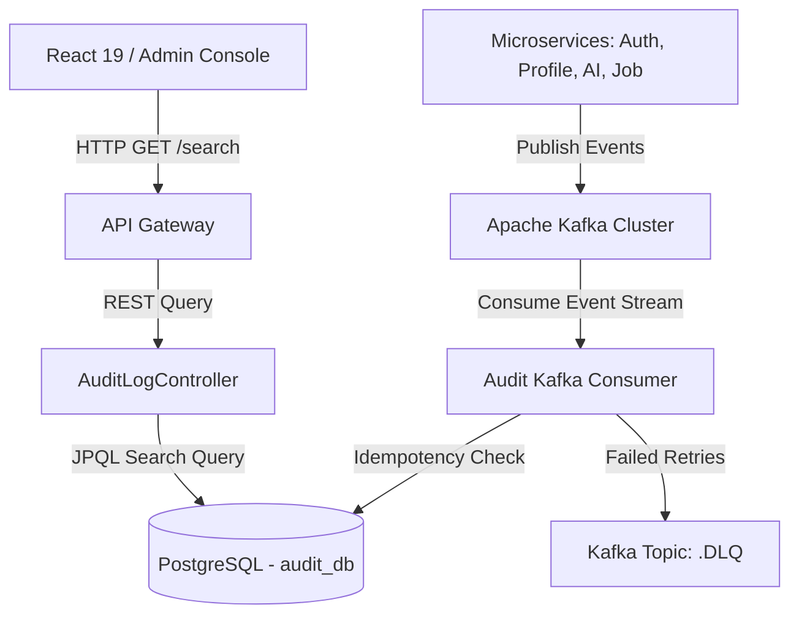

# Audit Service - Architecture & System Design Document

## 1. Overall System Architecture

## 2. Event & Data Specifications

### A. Idempotent Consumer Flow
1. Message received from Kafka partition.
2. Extract `eventId`.
3. Perform index lookup on PostgreSQL table `audit_logs`.
4. If found -> Commit Kafka offset & skip processing.
5. If absent -> Execute `@Transactional` save -> Commit Kafka offset.

### B. Retry & Dead Letter Queue (DLQ) Recovery
- **Retry Count**: 3 attempts
- **Backoff Delay**: 1000ms
- **DLQ Topic Pattern**: `{original_topic}.DLQ`

### C. Database Migration & Schema
- **Flyway Migration**: `V1__init_audit_schema.sql`
- **Composite Indexes**:
  - `idx_audit_event_id` (UNIQUE)
  - `idx_audit_user_id_timestamp` (`user_id`, `timestamp DESC`)
  - `idx_audit_service_event` (`service_name`, `event_type`)
  - `idx_audit_timestamp` (`timestamp DESC`)

## 3. AWS Deployment Plan (EKS / MSK / RDS / CloudWatch)
1. **Event Infrastructure**: AWS MSK (Managed Streaming for Apache Kafka) with IAM SASL authentication.
2. **Compute Layer**: AWS EKS Kubernetes deployment with HPA scaling based on consumer lag metrics.
3. **Storage Layer**: AWS RDS PostgreSQL Multi-AZ instance.
4. **CloudWatch Metrics**: Export consumer lag, retry counts, and DLQ message alerts to AWS CloudWatch Alarms.

## 4. Future ML & Data Lake Integration
- **AWS Kinesis Data Firehose**: Stream PostgreSQL audit events to AWS S3 Data Lake (Parquet format).
- **Apache Spark / Airflow**: Process audit events to compute candidate engagement scores for ML recommendation models.
