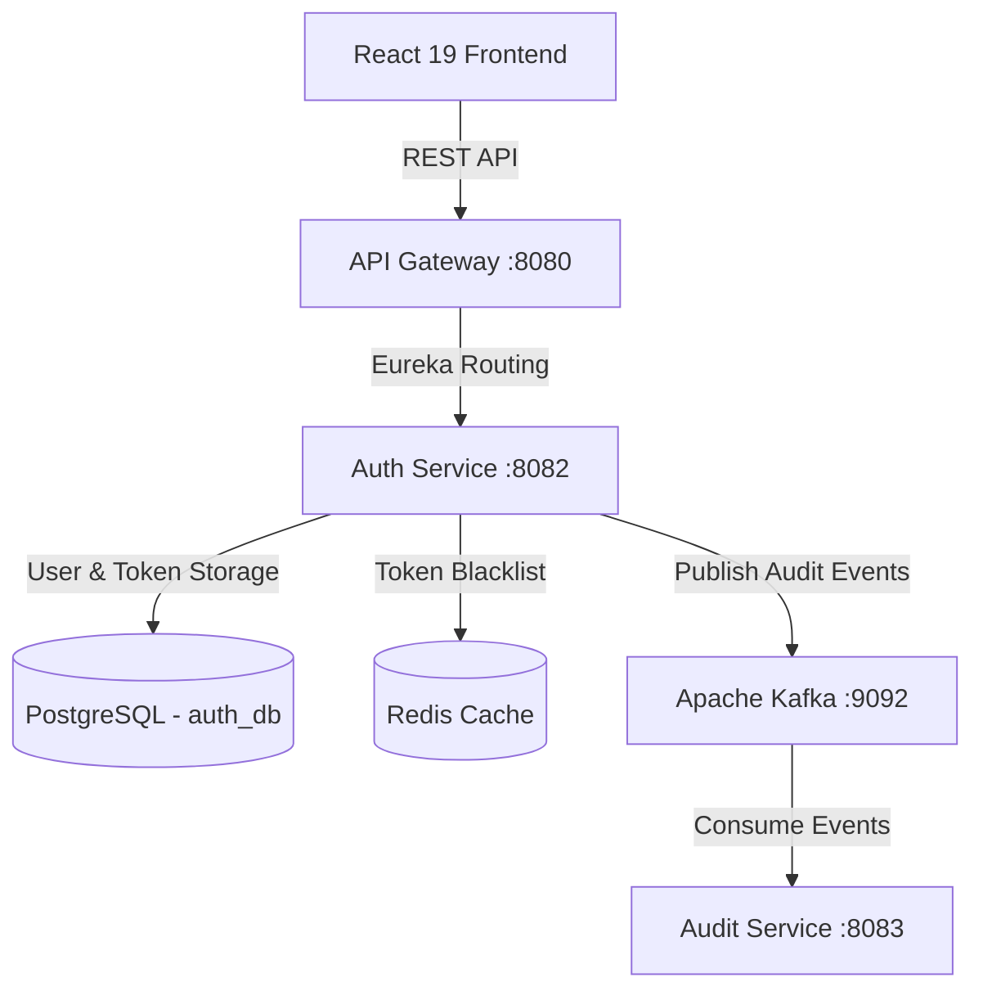

# Auth Service - Architecture & System Design Document

## 1. Overall System Architecture

## 2. Component Specifications

### A. Database Schema & Flyway
- **Flyway Migration**: `V1__init_auth_schema.sql`
- **Tables**: `users`, `user_roles`, `refresh_tokens`
- **Indexes**: `idx_user_email` (UNIQUE), `idx_token_value` (UNIQUE)

### B. Security & Token Lifecycle
- **Password Encoder**: BCryptPasswordEncoder (strength 10)
- **Token Algorithm**: HMAC-SHA256 (`jjwt`)
- **Token Rotation**: Old refresh tokens deleted on new token generation.

### C. AWS Deployment Blueprint
- **Compute**: AWS EKS Kubernetes Pods with HPA scaling.
- **Database**: AWS RDS PostgreSQL Multi-AZ.
- **Cache**: AWS ElastiCache for Redis token revocation.
- **Cognito Option**: AWS Cognito User Pools integration.
