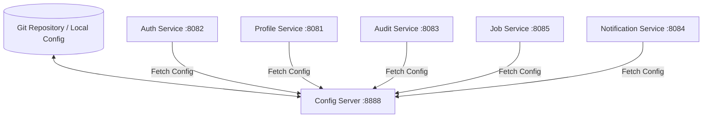

# Config Server - Architecture & System Design Document

## 1. Overall System Architecture

## 2. Component Specifications

### A. Configuration Storage Topology
- **Profile**: Native file system search locations (`classpath:/config`).
- **Endpoints**: `GET /{application}/{profile}` (e.g. `http://localhost:8888/auth-service/default`).

### B. AWS Deployment Blueprint
- **Compute**: AWS EKS Kubernetes Pods.
- **Backend Storage**: AWS CodeCommit / GitHub private repository or AWS Systems Manager (SSM).
- **Bus Refresh**: AWS MQ / RabbitMQ spring-cloud-bus broadcast.
