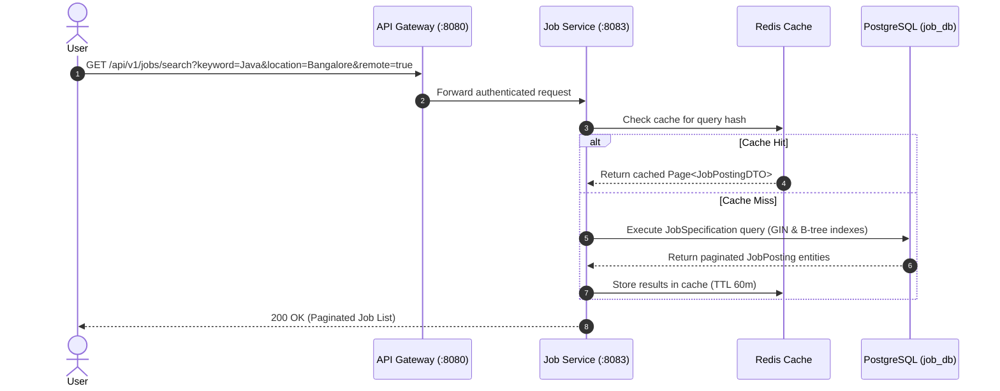
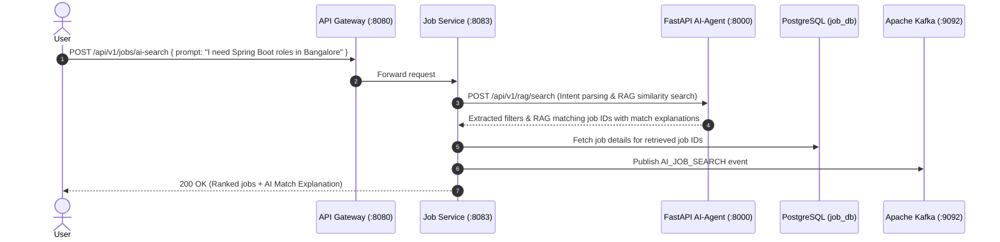
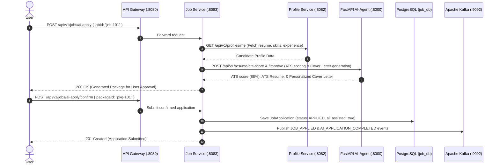

# Job & Application Microservice — Architecture & System Design Document

## 1. Executive System Architecture

The **CareerOS Job & Application Microservice** (`job-service`) is built using **Spring Boot 3**, **Java 21**, **PostgreSQL**, **Flyway**, **Redis**, **Kafka**, and **Clean Architecture**. It acts as the core workflow orchestrator for career opportunities, enabling two complete coexisting application models:
1. **Traditional Manual Job Search & Application**
2. **AI-Powered Conversational Job Search & AI-Assisted Job Application**

```mermaid
graph TD
    Client[React 19 Frontend] -->|REST API| Gateway[Spring Cloud API Gateway :8080]
    
    subgraph Job & Application Microservice Stack (:8083)
        Gateway -->|Eureka Discovery Routing| Controllers[REST Controllers: Jobs, Applications, AI Search, AI Apply]
        Controllers --> Services[Domain Services: JobSearchService, ApplicationService, AIJobSearchService]
        
        Services --> Specs[JPA Specifications: Dynamic Filter Engine]
        Services --> DB[(PostgreSQL: job_db)]
        Services --> RedisCache[(Redis Cache: 1-hr TTL)]
        
        Services --> FeignAI[Feign REST Client: AI-Agent Service :8000]
        Services --> FeignProfile[Feign REST Client: Profile Service :8082]
        Services --> KafkaProducer[Kafka Event Producer]
    end
    
    FeignAI -->|RAG & Intent Extraction| AIAgent[FastAPI AI-Agent Service]
    FeignProfile -->|Retrieve Candidate Profile| ProfileService[Profile Service]
    KafkaProducer -->|Stream Audit Events| Kafka[Apache Kafka :9092]
    Kafka -->|Consume Events| AuditService[Audit Service :8085]
    Kafka -->|Consume Notification Events| NotificationService[Notification Service :8084]
```

---

## 2. Sequence Diagrams for Core Workflows

### Workflow 1: Traditional Manual Job Search & Filtering



---

### Workflow 2: AI-Powered Conversational Search (RAG)



---

### Workflow 3: AI-Assisted Job Application ("Apply with AI")



---

## 3. Database Schema Specifications & Flyway Migrations

The microservice manages five core tables initialized via Flyway (`V1__init_job_schema.sql`):

| Table Name | Primary Purpose | Key Columns & Indexes |
| :--- | :--- | :--- |
| `job_postings` | Stores job listings, company data, and requirements | `id`, `company_name`, `title`, `description`, `min_salary`, `max_salary`, `experience_level`, `employment_type`, `is_remote`, `status`. **Indexes**: `idx_job_company`, `idx_job_location`, `idx_job_salary`. |
| `job_required_skills` | Skills associated with each job posting | `job_id`, `skill_name`. **Index**: `idx_job_skills` on `skill_name`. |
| `job_applications` | Stores user application tracking & ATS scores | `id`, `job_id`, `candidate_id`, `status`, `resume_url`, `cover_letter`, `ats_score`, `ai_assisted`. **Index**: `idx_app_candidate_job` (unique per candidate/job). |
| `job_bookmarks` | Candidate saved/bookmarked jobs | `candidate_id`, `job_id`, `created_at`. |
| `recent_job_views` | Tracks candidate recently viewed job postings | `candidate_id`, `job_id`, `viewed_at`. |

---

## 4. Production Architectural Best Practices

1. **Zero-AI Logic in Job Service**: All NLP, vector search, embeddings, ATS scoring, and LLM prompt engineering are strictly encapsulated inside `AI-Agent`. `job-service` purely orchestrates business transactions.
2. **Dynamic JPA Specifications**: Type-safe dynamic filtering using Spring Data JPA `Specification<JobPosting>` avoiding raw SQL injection risks.
3. **Optimistic Locking**: Enforced via `@Version` field on `JobPosting` and `JobApplication` to prevent race conditions during concurrent updates.
4. **Soft Delete**: Implemented via `@SQLDelete(sql = "UPDATE job_postings SET deleted = true WHERE id = ?")` and `@Where(clause = "deleted = false")`.
