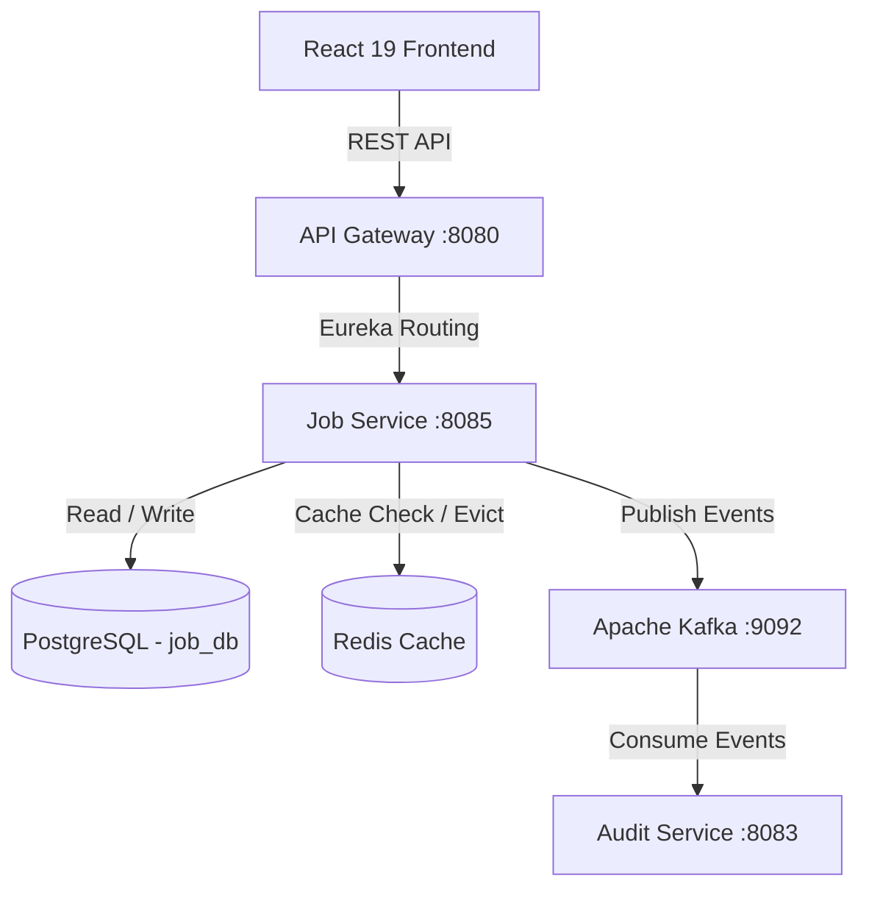

# Job Service - Architecture & System Design Document

## 1. Overall System Architecture

## 2. Component Specifications

### A. Database Flow & Schema Migrations
- **Flyway Migration**: `V1__init_job_schema.sql`
- **Tables**: `job_postings`, `job_required_skills`, `job_applications`
- **Indexes**:
  - `idx_job_company` (`company_name`)
  - `idx_job_status` (`status`)
  - `idx_app_candidate` (`candidate_id`, `created_at DESC`)
  - `idx_app_job` (`job_id`, `created_at DESC`)

### B. Caching Strategy
- Redis Cache `jobs` with 1-hour TTL and JSON serialization.

### C. AWS Deployment Blueprint
- **Compute**: AWS EKS Kubernetes Pods with HPA scaling.
- **Database**: AWS RDS PostgreSQL Multi-AZ.
- **Cache**: AWS ElastiCache for Redis.
- **Event Streaming**: AWS MSK (Managed Streaming for Apache Kafka).
