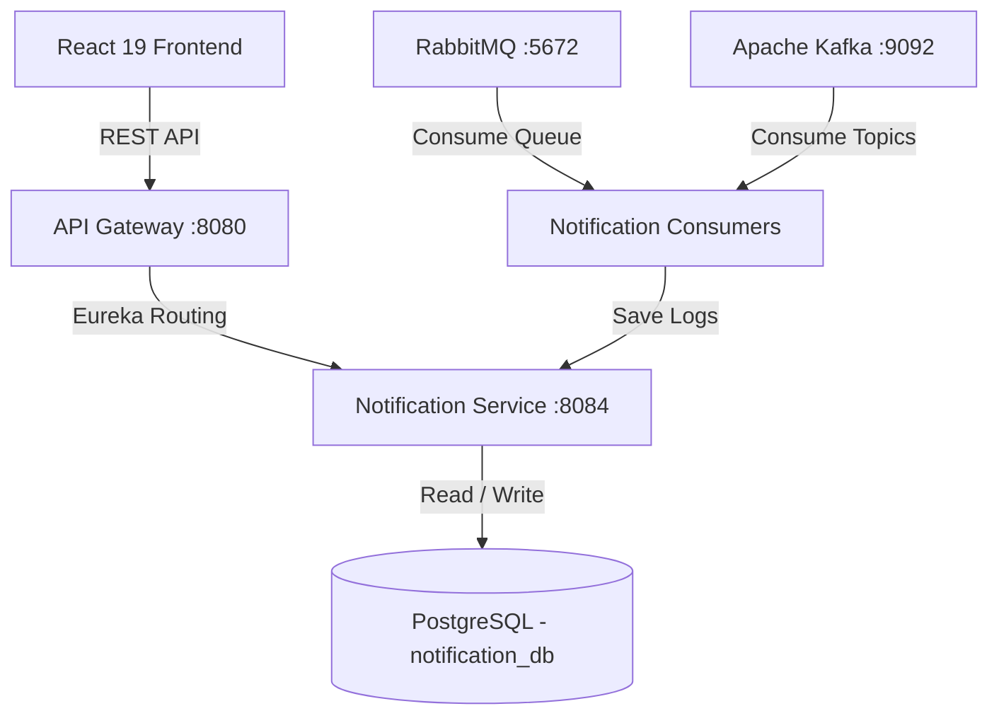

# Notification Service - Architecture & System Design Document

## 1. Overall System Architecture

## 2. Component Specifications

### A. Database Schema & Flyway
- **Flyway Migration**: `V1__init_notification_schema.sql`
- **Tables**: `notification_logs`
- **Indexes**: `idx_notif_recipient` (`recipient_id`, `created_at DESC`), `idx_notif_status`, `idx_notif_type`, `idx_notif_event`

### B. Dual Messaging Topology
- **RabbitMQ**: Exchange `careeros.notification.exchange`, Queue `careeros.notification.queue`, Routing Key `notification.routingKey`.
- **Kafka**: Topic `careeros.notification.events`, Consumer Group `careeros-notification-group`.

### C. AWS Deployment Blueprint
- **Compute**: AWS EKS Kubernetes Pods with HPA scaling.
- **Messaging**: AWS Amazon MQ (Managed RabbitMQ) & AWS MSK (Managed Kafka).
- **Email & SMS**: AWS SES (Email) & AWS SNS (SMS / Push).
