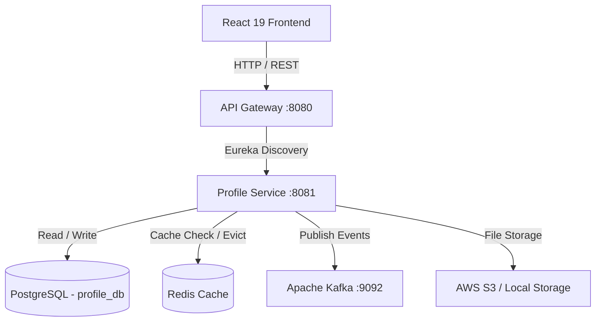

# Profile Service - Architecture & System Design Document

## 1. Overall System Architecture


## 2. Component Flow Specifications

### A. Database Flow & Schema Migrations
- **Database**: PostgreSQL 16
- **Migration Tool**: Flyway versioned migrations (`V1__init_profile_schema.sql`).
- **Indexes**:
  - `idx_profile_user_id`: Unique index on `user_id` for $O(1)$ candidate lookups.
  - `idx_profile_headline`: Trigram index for headline text search.
  - Composite indexes on foreign keys (`profile_id`).

### B. Caching Flow (Redis)
- **Cache Name**: `profiles`
- **Serialization**: `GenericJackson2JsonRedisSerializer`
- **TTL**: 3600 seconds (1 hour)
- **Pattern**: Cache-Aside Pattern with `@Cacheable(key = "#id")` and `@CacheEvict(key = "#id")` on update/delete.

### C. Event Streaming Flow (Kafka)
- **Topic**: `careeros.profile.events`
- **Partition Strategy**: Keyed by `userId` to guarantee message ordering per candidate.
- **Event Schema**:
  ```json
  {
    "eventId": "uuid",
    "eventType": "PROFILE_UPDATED",
    "userId": "uuid",
    "serviceName": "PROFILE_SERVICE",
    "timestamp": "2026-07-31T14:45:00Z"
  }
  ```

### D. Security & Gateway Flow
- Token validation is offloaded to API Gateway.
- Profile Service extracts pre-validated `X-User-Id` and `X-Correlation-Id` HTTP headers.

### E. Monitoring & Observability
- **Prometheus Metrics**: Exposes `/actuator/prometheus` (JVM memory, DB pool connections, HTTP latency).
- **OpenTelemetry Tracing**: Correlation ID propagated across HTTP and Kafka requests.

## 3. AWS Deployment Plan (EKS / ECS / RDS / S3)
1. **Containerization**: Built as lightweight OCI image using Docker.
2. **Compute**: Deployed to AWS EKS (Kubernetes) with HPA (Horizontal Pod Autoscaler) scaling on CPU (70%) and HTTP throughput.
3. **Database**: Managed AWS RDS PostgreSQL (Multi-AZ deployment).
4. **Caching**: AWS ElastiCache for Redis (Cluster mode enabled).
5. **File Storage**: AWS S3 Bucket `careeros-profile-avatars` with CloudFront CDN for global image delivery.

## 4. Future ML & AI Integration Points
- **Feature Store Integration**: Export candidate skills and experience timelines to AWS SageMaker Feature Store for training ML recommendation models.
- **Semantic Vector Embedding Pipeline**: Stream DB updates to Kafka -> Python consumer -> OpenAI Embeddings -> Vector DB (Chroma / AWS OpenSearch).
