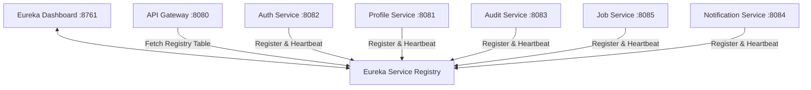

# Service Registry - Architecture & System Design Document

## 1. Overall System Architecture

## 2. Component Specifications

### A. Core Discovery Topology
- **Standalone Server**: Runs on port `:8761` with `register-with-eureka: false` and `fetch-registry: false`.
- **Heartbeat Schedule**: 30s lease renewal interval with 90s expiration threshold.
- **Eviction Timer**: 60s background eviction scanner.

### B. AWS Deployment Blueprint
- **Compute**: AWS EKS Pods or AWS ECS Tasks.
- **High Availability**: Multi-AZ Eureka Server peer replication.
- **Cloud Native Alternative**: AWS Cloud Map private DNS namespace.
