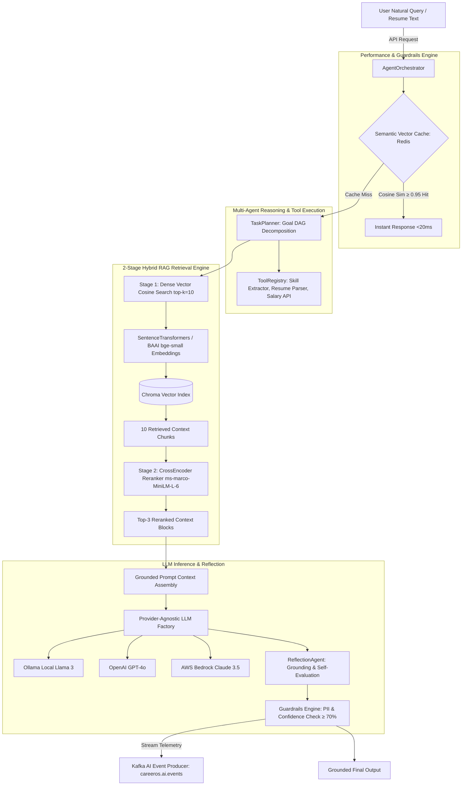

# 🚀 CareerOS — Enterprise AI-Powered Career & Job Platform

[](https://spring.io/projects/spring-boot)
[](https://www.oracle.com/java/)
[](https://fastapi.tiangolo.com/)
[](https://www.python.org/)
[](https://react.dev/)
[](https://www.docker.com/)
[](https://kafka.apache.org/)
[](https://www.postgresql.org/)

**CareerOS** is an enterprise-grade, event-driven AI platform built with **10 Spring Boot 3 Java 21 microservices**, a **FastAPI Python 3.12 Multi-Agent AI Service**, a **2-Stage RAG Pipeline**, **Apache Kafka**, **RabbitMQ**, **Redis**, **PostgreSQL**, **ChromaDB**, and a **React 19 Frontend**.

---

## 1. Master System Architecture Diagram

```mermaid
graph TD
    Client[React 19 Frontend :3000] -->|HTTPS REST / JWT| Gateway[Spring Cloud API Gateway :8080]
    Gateway -->|Eureka Discovery| Eureka[Eureka Service Registry :8761]
    
    subgraph Java Spring Boot Microservice Ecosystem
        Gateway --> Auth[Auth Service :8081]
        Gateway --> Profile[Profile Service :8082]
        Gateway --> Job[Job Service :8083]
        Gateway --> Notification[Notification Service :8084]
        Gateway --> Audit[Audit Service :8085]
        
        Profile -->|Read/Write| ProfileDB[(PostgreSQL - profile_db)]
        Job -->|Read/Write| JobDB[(PostgreSQL - job_db)]
        Auth -->|Read/Write| AuthDB[(PostgreSQL - auth_db)]
        Audit -->|Read/Write| AuditDB[(PostgreSQL - audit_db)]
        
        Profile -->|Cache| Redis[(Redis Cluster :6379)]
        Job -->|Cache| Redis
    end
    
    subgraph FastAPI Multi-Agent AI Microservice (:8000)
        Gateway -->|HTTP Routing /api/v1/ai| AIAgent[FastAPI Core Orchestrator]
        Job -->|Feign REST Client| AIAgent
        
        AIAgent --> Planner[TaskPlanner & ToolRegistry]
        AIAgent --> RAG[2-Stage RAG Pipeline]
        AIAgent --> SemanticCache[Vector Semantic Cache: Redis]
        
        RAG --> Embeddings[SentenceTransformers all-MiniLM-L6-v2]
        Embeddings --> Chroma[(Chroma Vector DB)]
        RAG --> CrossEncoder[CrossEncoder Reranker ms-marco-MiniLM-L-6]
        
        AIAgent --> LLMFactory[LLM Provider Factory]
        LLMFactory --> LocalOllama[Ollama Local Llama 3]
        LLMFactory --> OpenAI[OpenAI GPT-4o]
        LLMFactory --> Bedrock[AWS Bedrock Claude 3.5]
    end
    
    subgraph Event Streaming & Messaging Pipelines
        Auth -->|Publish USER_REGISTERED| Kafka[Apache Kafka :9092]
        Profile -->|Publish PROFILE_UPDATED| Kafka
        Job -->|Publish JOB_APPLIED| Kafka
        AIAgent -->|Publish AI_EVENTS| Kafka
        
        Kafka -->|Consume Events| Audit
        Kafka -->|Consume Notifications| Notification
        Notification -->|Queue Notifications| RabbitMQ[RabbitMQ :5672]
        Notification -->|SMTP Email Sandbox| Mailpit[Mailpit :8025]
    end
```

---

## 2. AI Agent Architecture with 2-Stage RAG Pipeline



---

## 3. Microservice Catalog & Port Reference Table

| Service Name | Technology Stack | Port | Primary Responsibilities |
| :--- | :--- | :--- | :--- |
| **Service Registry** | Spring Cloud Eureka | `:8761` | Service discovery and health registration for microservices. |
| **Config Server** | Spring Cloud Config | `:8888` | Centralized git/file configuration management. |
| **API Gateway** | Spring Cloud Gateway | `:8080` | Reactive gateway routing, JWT validation, and rate limiting. |
| **Auth Service** | Spring Boot 3 / PostgreSQL | `:8081` | JWT authentication, user registration, and security token issuance. |
| **Profile Service** | Spring Boot 3 / AWS S3 | `:8082` | Candidate profile management, experience tracking, and S3 resume uploads. |
| **Job Service** | Spring Boot 3 / Flyway | `:8083` | Dynamic JPA job search, traditional applications, & Feign AI Apply flows. |
| **Notification Service** | Spring Boot 3 / RabbitMQ | `:8084` | Asynchronous email/SMS dispatches via RabbitMQ and Mailpit. |
| **Audit Service** | Spring Boot 3 / Kafka | `:8085` | Centralized audit log streaming and operational telemetry storage. |
| **AI-Agent Microservice** | FastAPI / ChromaDB | `:8000` | Clean Architecture 19-module multi-agent system, RAG, and LLM factory. |
| **Frontend Web App** | React 19 / Vite | `:3000` | Executive web portal with 11 pages and zero-cost offline demo mode. |

---

## 4. Key Platform Features

- **Dual Job Search Engines**: Traditional manual JPA Specification dynamic filtering coexisting with AI conversational intent-based RAG search.
- **Dual Job Application Workflows**: Traditional manual resume submission coexisting with **Apply with AI 🪄** (ATS compatibility scoring, resume optimization, and candidate approval confirmation flow).
- **2-Stage Hybrid RAG Pipeline**: Bi-Encoder vector search + Stage-2 CrossEncoder reranking (`ms-marco-MiniLM-L-6-v2`) for zero-hallucination grounded responses.
- **Vector Semantic Cache**: Redis-backed cosine similarity cache returning semantically identical query responses in $<20\text{ms}$ ($O(1)$ latency).
- **Provider-Agnostic LLM Engine**: Swappable LLM providers (**Ollama local Llama 3**, **OpenAI GPT-4o**, **AWS Bedrock Claude 3.5**) via environment settings.
- **Zero-Cost Instant Demo Mode**: Ships with deterministic offline mock fallbacks for all AI endpoints, enabling immediate offline demos without paid API keys.

---

## 5. Quick Start: Running the Full Stack

### **Option A: Run Full Stack with Docker Compose**
```bash
docker compose up -d --build
```
Access points:
- **Frontend App**: `http://localhost:3000`
- **API Gateway**: `http://localhost:8080`
- **AI Agent OpenAPI Docs**: `http://localhost:8000/docs`
- **Eureka Dashboard**: `http://localhost:8761`
- **Kafka UI**: `http://localhost:8088`

### **Option B: Run Services Locally for Development**
```bash
# 1. Build and package all Java Microservices
cd Backend
.\mvnw.cmd clean package -DskipTests

# 2. Start FastAPI AI Agent
cd ../AI-Agent
py -m uvicorn app.main:app --reload --port 8000

# 3. Start React Frontend
cd ../Frontend
npm run dev
```

---

## 6. Architecture & Operations Documentation

- **[Master System Architecture](file:///c:/Users/91741/Documents/Dream_NO.1/ARCHITECTURE.md)**
- **[AI Agent Master Architecture](file:///c:/Users/91741/Documents/Dream_NO.1/AI-Agent/ARCHITECTURE.md)**
- **[AI Agent Service Guide & Interview Q&A](file:///c:/Users/91741/Documents/Dream_NO.1/AI-Agent/SERVICE_GUIDE.md)**
- **[Job Service Architecture & Guide](file:///c:/Users/91741/Documents/Dream_NO.1/Backend/job-service/SERVICE_GUIDE.md)**
- **[Deployment & Production Operations](file:///c:/Users/91741/Documents/Dream_NO.1/DEPLOYMENT.md)**
