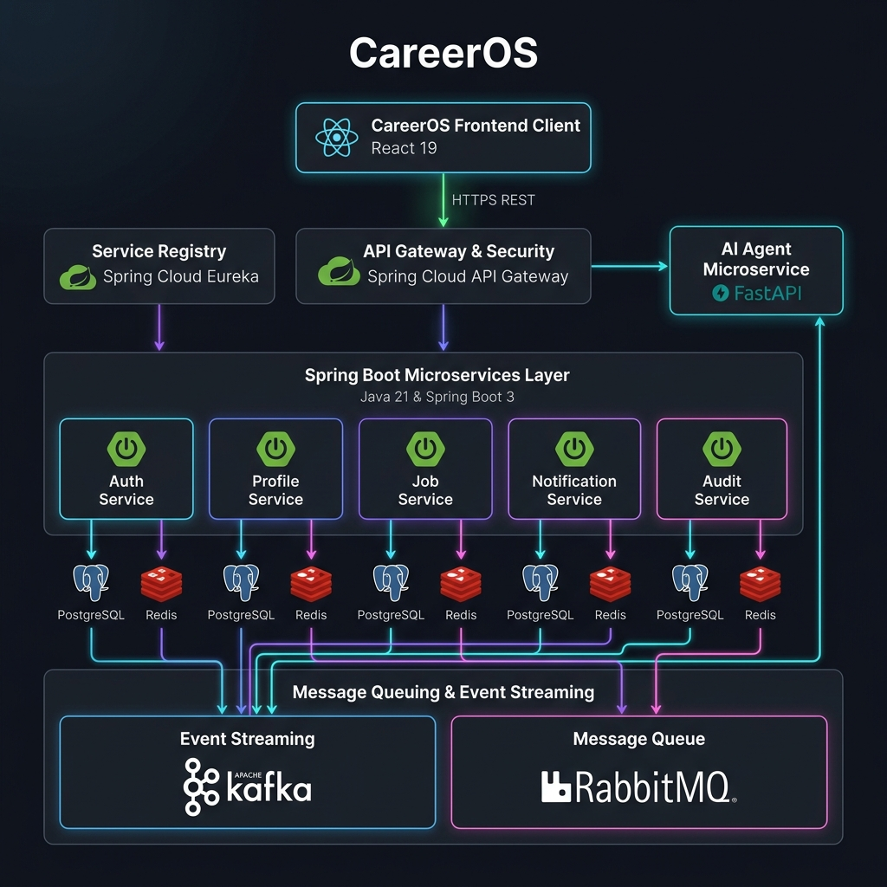
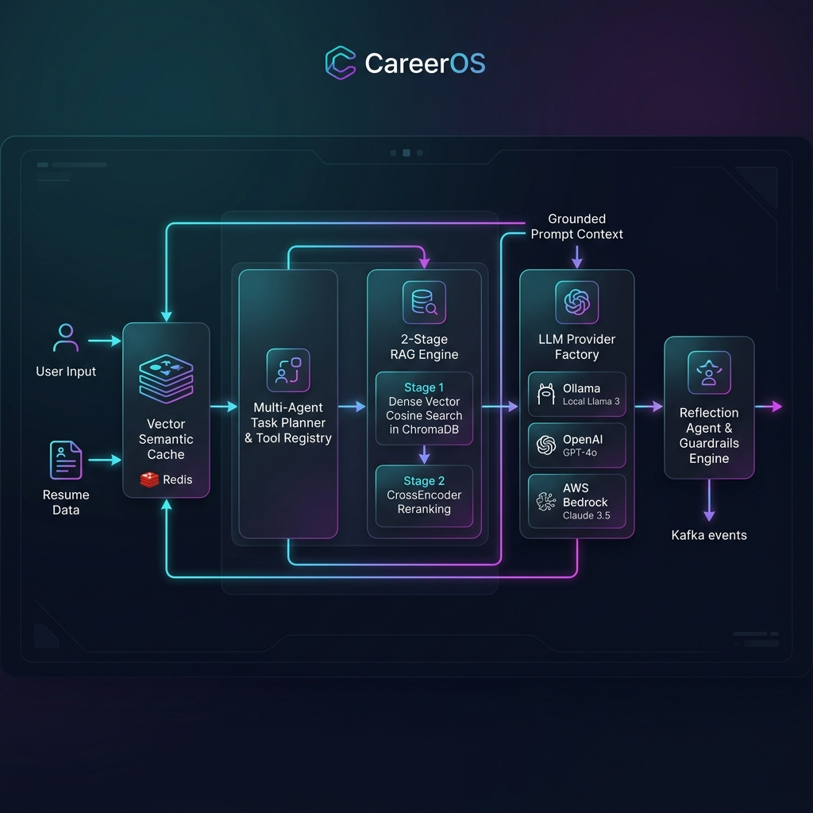
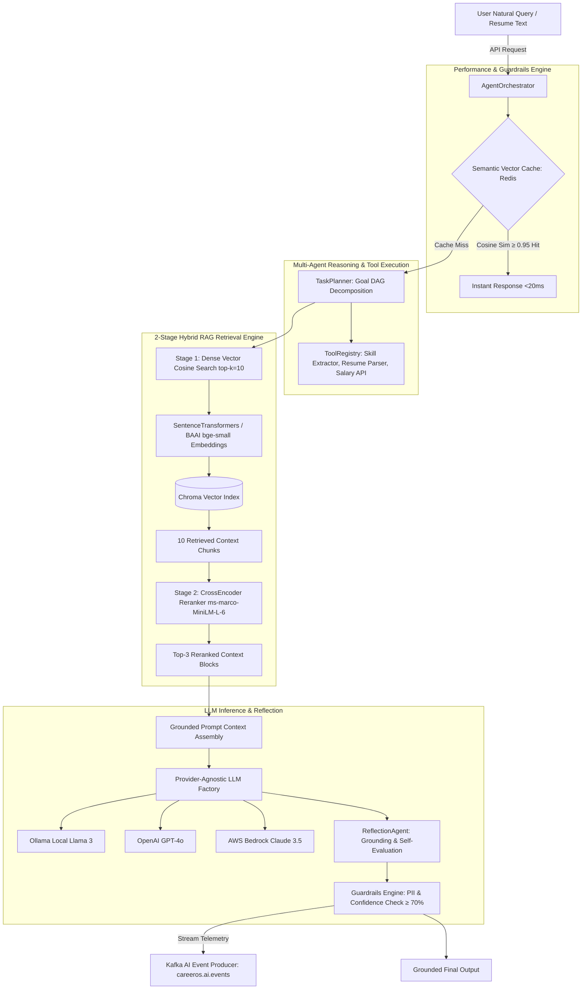

# 🚀 CareerOS — Enterprise AI-Powered Career & Job Platform

[](https://spring.io/projects/spring-boot)
[](https://www.oracle.com/java/)
[](https://fastapi.tiangolo.com/)
[](https://www.python.org/)
[](https://react.dev/)
[](https://www.docker.com/)
[](https://kafka.apache.org/)
[](https://www.rabbitmq.com/)
[](https://www.postgresql.org/)

**CareerOS** is an enterprise-grade, event-driven AI platform built with **10 Spring Boot 3 Java 21 microservices**, a **FastAPI Python 3.12 Multi-Agent AI Service**, a **2-Stage RAG Pipeline**, **Apache Kafka**, **RabbitMQ**, **Redis**, **PostgreSQL**, **ChromaDB**, and a **React 19 Frontend**.

---

## 1. Master System Architecture Diagram



```mermaid
graph TD
    Client[React 19 Frontend :3000] -->|HTTPS REST / JWT| Gateway[Spring Cloud API Gateway :8080]
    Gateway -->|Eureka Discovery| Eureka[Eureka Service Registry :8761]
    
    subgraph Java Spring Boot Microservice Ecosystem
        Gateway --> Auth[Auth Service :8081]
        Gateway --> Profile[Profile Service :8082]
        Gateway --> Job[Job Service :8083]
        Gateway --> Notification[Notification Service :8084]
        Gateway --> Audit[Audit Service :8085]
        
        Profile -->|Read/Write| ProfileDB[(PostgreSQL - profile_db)]
        Job -->|Read/Write| JobDB[(PostgreSQL - job_db)]
        Auth -->|Read/Write| AuthDB[(PostgreSQL - auth_db)]
        Audit -->|Read/Write| AuditDB[(PostgreSQL - audit_db)]
        
        Profile -->|Cache| Redis[(Redis Cluster :6379)]
        Job -->|Cache| Redis
    end
    
    subgraph FastAPI Multi-Agent AI Microservice (:8000)
        Gateway -->|HTTP Routing /api/v1/ai| AIAgent[FastAPI Core Orchestrator]
        Job -->|Feign REST Client| AIAgent
        
        AIAgent --> Planner[TaskPlanner & ToolRegistry]
        AIAgent --> RAG[2-Stage RAG Pipeline]
        AIAgent --> SemanticCache[Vector Semantic Cache: Redis]
        
        RAG --> Embeddings[SentenceTransformers all-MiniLM-L6-v2]
        Embeddings --> Chroma[(Chroma Vector DB)]
        RAG --> CrossEncoder[CrossEncoder Reranker ms-marco-MiniLM-L-6]
        
        AIAgent --> LLMFactory[LLM Provider Factory]
        LLMFactory --> LocalOllama[Ollama Local Llama 3]
        LLMFactory --> OpenAI[OpenAI GPT-4o]
        LLMFactory --> Bedrock[AWS Bedrock Claude 3.5]
    end
    
    subgraph Event Streaming & Messaging Pipelines
        Auth -->|Publish USER_REGISTERED| Kafka[Apache Kafka :9092]
        Profile -->|Publish PROFILE_UPDATED| Kafka
        Job -->|Publish JOB_APPLIED| Kafka
        AIAgent -->|Publish AI_EVENTS| Kafka
        
        Kafka -->|Consume Events| Audit
        Kafka -->|Consume Notifications| Notification
        Notification -->|Queue Notifications| RabbitMQ[RabbitMQ :5672]
        Notification -->|SMTP Email Sandbox| Mailpit[Mailpit :8025]
    end
```

---

## 2. AI Agent & 2-Stage RAG Architecture Diagram





---

## 3. Comprehensive Technology Stack & Microservice Catalog

### **Core Platform Technology Stack**

| Technology Layer | Tool / Framework | Version / Provider | Architectural Purpose |
| :--- | :--- | :--- | :--- |
| **Backend Microservices** | Spring Boot | `3.4.1` (Java 21) | Core domain business services, REST APIs, & JPA transaction boundaries. |
| **Service Discovery** | Spring Cloud Eureka | `2024.0.0` | Dynamic service registration & network address resolution. |
| **Config Server** | Spring Cloud Config | `2024.0.0` | Centralized git/file configuration management. |
| **API Gateway** | Spring Cloud Gateway | `2024.0.0` | Non-blocking reactive gateway, JWT security, & route proxying. |
| **AI Agent Microservice** | FastAPI / Python | `0.110.0` / `3.12` | 19-module Clean Architecture multi-agent system & RAG pipeline. |
| **Vector DB** | ChromaDB | `0.4.24` | Local & embedded persistent vector embeddings index. |
| **CrossEncoder Reranker**| SentenceTransformers | `ms-marco-MiniLM-L-6-v2` | Stage-2 CrossEncoder passage reranking for zero hallucination. |
| **LLM Provider Engine** | Ollama / OpenAI / AWS Bedrock | Llama 3 / GPT-4o / Claude 3.5 | Provider-agnostic LLM inference with offline mock fallback. |
| **Frontend Web App** | React 19 / Vite | `19.0.0` / `6.4.3` | Modern executive web dashboard with glassmorphism design system. |
| **Database Management** | PostgreSQL / Flyway | `16.2` / `10.0` | Relational SQL persistence with automated versioned migrations. |
| **Caching Layer** | Redis | `7.2` | Profile caching & vector semantic similarity query cache ($<20\text{ms}$). |
| **Event Streaming** | Apache Kafka | `3.7` | High-throughput distributed event streaming for audit telemetry. |
| **Message Queue** | RabbitMQ | `3.13` | Reliable AMQP queue for asynchronous email/SMS notifications. |
| **Email Sandbox** | Mailpit | `1.15` | Developer local SMTP sandbox for testing email dispatches. |
| **Containerization** | Docker & Docker Compose | `24.0` | 24-container multi-stage enterprise orchestration stack. |

---

## 4. Microservice Catalog & Port Reference Table

| Service Name | Port | Description & Responsibilities |
| :--- | :--- | :--- |
| **API Gateway** | `:8080` | Entrypoint routing `/api/v1/*` endpoints, enforcing JWT security and CORS. |
| **Auth Service** | `:8081` | User registration, login, JWT token issuance, and password security. |
| **Profile Service** | `:8082` | Candidate profile management, skill matrices, experience, & AWS S3 resume uploads. |
| **Job Service** | `:8083` | Dual job search (JPA Specs & AI RAG) and dual application models (Manual & Apply with AI). |
| **Notification Service** | `:8084` | Consumes RabbitMQ queues & delivers emails via Mailpit SMTP. |
| **Audit Service** | `:8085` | Consumes Kafka topics (`careeros.*.events`) storing structured system audit logs. |
| **Eureka Service Registry**| `:8761` | Live dashboard showing all registered active microservices. |
| **Config Server** | `:8888` | Serves property configurations to Java microservices. |
| **FastAPI AI Agent** | `:8000` | Multi-agent orchestrator, 2-Stage RAG engine, ATS scoring, & roadmap generator. |
| **React Frontend** | `:3000` | Executive web portal with 11 pages and zero-cost offline demo mode. |

---

## 5. Quick Start: Running the Full Stack

### **Option A: Run Full Stack with Docker Compose**
```bash
docker compose up -d --build
```
Access points:
- **React Frontend**: `http://localhost:3000`
- **Spring Cloud Gateway**: `http://localhost:8080`
- **FastAPI AI Agent OpenAPI Docs**: `http://localhost:8000/docs`
- **Eureka Service Registry**: `http://localhost:8761`
- **Kafka UI**: `http://localhost:8088`
- **Mailpit Email Sandbox**: `http://localhost:8025`

### **Option B: Run Services Locally for Development**
```bash
# 1. Package Java Microservices
cd Backend
.\mvnw.cmd clean package -DskipTests

# 2. Start FastAPI AI Agent
cd ../AI-Agent
py -m uvicorn app.main:app --reload --port 8000

# 3. Start React Frontend
cd ../Frontend
npm run dev
```

---

## 6. Master Documentation Architecture Files

- **[Master System Architecture Guide](file:///c:/Users/91741/Documents/Dream_NO.1/ARCHITECTURE.md)**
- **[AI Agent Master Architecture](file:///c:/Users/91741/Documents/Dream_NO.1/AI-Agent/ARCHITECTURE.md)**
- **[AI Agent Service Guide & Interview Q&A](file:///c:/Users/91741/Documents/Dream_NO.1/AI-Agent/SERVICE_GUIDE.md)**
- **[Job Service Architecture & Guide](file:///c:/Users/91741/Documents/Dream_NO.1/Backend/job-service/SERVICE_GUIDE.md)**
- **[Deployment & Production Operations](file:///c:/Users/91741/Documents/Dream_NO.1/DEPLOYMENT.md)**
