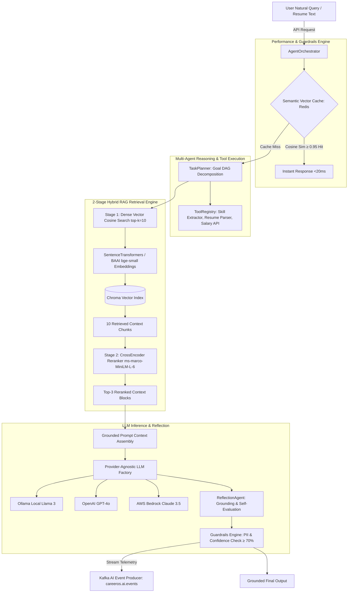

# 🚀 CareerOS — Enterprise AI-Powered Career & Job Platform

[](https://spring.io/projects/spring-boot)
[](https://www.oracle.com/java/)
[](https://fastapi.tiangolo.com/)
[](https://www.python.org/)
[](https://react.dev/)
[](https://www.docker.com/)
[](https://kafka.apache.org/)
[](https://www.rabbitmq.com/)
[](https://www.postgresql.org/)

**CareerOS** is an enterprise-grade, event-driven AI platform built with **10 Spring Boot 3 Java 21 microservices**, a **FastAPI Python 3.12 Multi-Agent AI Service**, a **2-Stage RAG Pipeline**, **Apache Kafka**, **RabbitMQ**, **Redis**, **PostgreSQL**, **ChromaDB**, and a **React 19 Frontend**.

---

## 1. Master System Architecture Diagram

```mermaid
graph TD
    Client[React 19 Frontend :3000] -->|HTTPS REST / JWT| Gateway[Spring Cloud API Gateway :8080]
    Gateway -->|Eureka Discovery| Eureka[Eureka Service Registry :8761]
    
    subgraph Java Spring Boot Microservice Ecosystem
        Gateway --> Auth[Auth Service :8081]
        Gateway --> Profile[Profile Service :8082]
        Gateway --> Job[Job Service :8083]
        Gateway --> Notification[Notification Service :8084]
        Gateway --> Audit[Audit Service :8085]
        
        Profile -->|Read/Write| ProfileDB[(PostgreSQL - profile_db)]
        Job -->|Read/Write| JobDB[(PostgreSQL - job_db)]
        Auth -->|Read/Write| AuthDB[(PostgreSQL - auth_db)]
        Audit -->|Read/Write| AuditDB[(PostgreSQL - audit_db)]
        
        Profile -->|Cache| Redis[(Redis Cluster :6379)]
        Job -->|Cache| Redis
    end
    
    subgraph FastAPI Multi-Agent AI Microservice (:8000)
        Gateway -->|HTTP Routing /api/v1/ai| AIAgent[FastAPI Core Orchestrator]
        Job -->|Feign REST Client| AIAgent
        
        AIAgent --> Planner[TaskPlanner & ToolRegistry]
        AIAgent --> RAG[2-Stage RAG Pipeline]
        AIAgent --> SemanticCache[Vector Semantic Cache: Redis]
        
        RAG --> Embeddings[SentenceTransformers all-MiniLM-L6-v2]
        Embeddings --> Chroma[(Chroma Vector DB)]
        RAG --> CrossEncoder[CrossEncoder Reranker ms-marco-MiniLM-L-6]
        
        AIAgent --> LLMFactory[LLM Provider Factory]
        LLMFactory --> LocalOllama[Ollama Local Llama 3]
        LLMFactory --> OpenAI[OpenAI GPT-4o]
        LLMFactory --> Bedrock[AWS Bedrock Claude 3.5]
    end
    
    subgraph Event Streaming & Messaging Pipelines
        Auth -->|Publish USER_REGISTERED| Kafka[Apache Kafka :9092]
        Profile -->|Publish PROFILE_UPDATED| Kafka
        Job -->|Publish JOB_APPLIED| Kafka
        AIAgent -->|Publish AI_EVENTS| Kafka
        
        Kafka -->|Consume Events| Audit
        Kafka -->|Consume Notifications| Notification
        Notification -->|Queue Notifications| RabbitMQ[RabbitMQ :5672]
        Notification -->|SMTP Email Sandbox| Mailpit[Mailpit :8025]
    end
```

---

## 2. Spring Boot Microservices Architecture Breakdown

CareerOS is architected using **Domain-Driven Design (DDD)** principles into 10 decoupled Java 21 microservices located in [`Backend/`](file:///c:/Users/91741/Documents/Dream_NO.1/Backend):

| Microservice | Technology | Port | Architecture & Key Responsibilities |
| :--- | :--- | :--- | :--- |
| **API Gateway** | Spring Cloud Gateway | `:8080` | Reactive non-blocking entrypoint. Validates JWT signatures, enforces CORS, applies rate-limiting, and routes requests to microservices. |
| **Service Registry** | Spring Cloud Eureka | `:8761` | Dynamic service discovery server tracking health and network locations of all registered microservice instances. |
| **Config Server** | Spring Cloud Config | `:8888` | Centralized cloud configuration server serving environment properties to all microservices. |
| **Auth Service** | Spring Boot 3 / PostgreSQL | `:8081` | Manages user registration, login, JWT token issuance, refresh tokens, and emits `USER_REGISTERED` Kafka events. |
| **Profile Service** | Spring Boot 3 / AWS S3 | `:8082` | Candidate profile management (skills, experience, education, projects) and AWS S3 resume file uploads. |
| **Job Service** | Spring Boot 3 / Flyway | `:8083` | Dual job search engines (JPA Specification & AI RAG) and dual application workflows (Manual & Apply with AI). |
| **Notification Service** | Spring Boot 3 / RabbitMQ | `:8084` | Asynchronous notification dispatches via RabbitMQ AMQP queues and SMTP email delivery (Mailpit sandbox). |
| **Audit Service** | Spring Boot 3 / Kafka | `:8085` | Centralized audit telemetry consumer storing structured system events in PostgreSQL with DLQ error handling. |
| **Common Module** | Java 21 Library | N/A | Shared DTO contracts, custom exceptions, Security Utils, and global response models. |

---

## 3. Dual Messaging Architecture: Apache Kafka vs. RabbitMQ

CareerOS uses a **Dual Message Broker Topology** leveraging the distinct strengths of both **Kafka** and **RabbitMQ**:

```
[System Events & User Actions]
       │
       ├──► Apache Kafka (:9092) ──────► Audit Service (High-throughput event logging & analytics)
       │    (Topics: careeros.auth.events, careeros.job.events, careeros.ai.events)
       │
       └──► RabbitMQ (:5672) ──────────► Notification Service (Reliable async email/SMS dispatches)
            (Exchange: careeros.notification.exchange | Queue: careeros.notification.queue)
```

### Why Both Brokers Are Used:

1. **Apache Kafka (High-Throughput Distributed Event Streaming)**:
   - Used for **immutable audit logs**, candidate behavioral analytics, and AI event streams (`careeros.ai.events`).
   - Supports event replay, partitioned topics, high concurrency ($100k+\text{ events/sec}$), and idempotent consumer processing.

2. **RabbitMQ (AMQP Asynchronous Message Queue)**:
   - Used for **targeted, task-based notifications** (welcome emails, job application confirmations, interview reminders).
   - Features durable direct exchanges (`careeros.notification.exchange`), Dead Letter Exchanges (DLX) for retry handling, and message delivery acknowledgments.

---

## 4. AI Agent Architecture & 2-Stage RAG Pipeline



---

## 5. React 19 Frontend Web Application

The frontend is a modern web application built with **React 19**, **Vite**, **Lucide Icons**, and custom **Glassmorphism CSS styling** located in [`Frontend/`](file:///c:/Users/91741/Documents/Dream_NO.1/Frontend):

### **Frontend Features & Page Breakdown**:
- **LinkedIn-Style Jobs Feed ([DashboardPage.jsx](file:///c:/Users/91741/Documents/Dream_NO.1/Frontend/src/pages/DashboardPage.jsx))**: Live search bar, filter badges (*All Jobs*, *✨ Top AI Match*, *🌐 Remote Only*, *🔖 Saved Jobs*), and company job cards with instant *Apply Now* and *Apply with AI 🪄* buttons.
- **AI Resume Optimizer ([ResumePage.jsx](file:///c:/Users/91741/Documents/Dream_NO.1/Frontend/src/pages/ResumePage.jsx))**: ATS keyword match analyzer, formatting score breakdown, and STAR bullet point rewriter.
- **Career Roadmap Generator ([CareerRoadmapPage.jsx](file:///c:/Users/91741/Documents/Dream_NO.1/Frontend/src/pages/CareerRoadmapPage.jsx))**: Interactive 9-month technical skill transition roadmap.
- **Mock Interview Coach ([InterviewPage.jsx](file:///c:/Users/91741/Documents/Dream_NO.1/Frontend/src/pages/InterviewPage.jsx))**: System design & technical question practice with STAR answer grading.
- **AI Assistant Chat ([AiChatPage.jsx](file:///c:/Users/91741/Documents/Dream_NO.1/Frontend/src/pages/AiChatPage.jsx))**: Conversational career advice backed by ChromaDB RAG retrieval.
- **Job Tracker & Applications ([JobTrackerPage.jsx](file:///c:/Users/91741/Documents/Dream_NO.1/Frontend/src/pages/JobTrackerPage.jsx))**: Drag-and-drop interview status tracking (`Applied` $\rightarrow$ `Screening` $\rightarrow$ `Interview` $\rightarrow$ `Offer`).
- **Audit Logs Stream ([AuditLogsPage.jsx](file:///c:/Users/91741/Documents/Dream_NO.1/Frontend/src/pages/AuditLogsPage.jsx))**: Real-time event log feed streamed from `audit-service`.
- **Zero-Cost Instant Demo Mode**: Includes deterministic offline mock engines allowing full testing of all 11 pages without needing paid API keys!

---

## 6. Quick Start: Running the Full Stack

### **Option A: Run Full Stack with Docker Compose**
```bash
docker compose up -d --build
```
Dashboard endpoints:
- **React Frontend**: `http://localhost:3000`
- **Spring Cloud Gateway**: `http://localhost:8080`
- **FastAPI AI Agent OpenAPI Docs**: `http://localhost:8000/docs`
- **Eureka Service Registry**: `http://localhost:8761`
- **Kafka UI**: `http://localhost:8088`
- **Mailpit Email Sandbox**: `http://localhost:8025`

### **Option B: Run Services Locally for Development**
```bash
# 1. Package Java Microservices
cd Backend
.\mvnw.cmd clean package -DskipTests

# 2. Start FastAPI AI Agent
cd ../AI-Agent
py -m uvicorn app.main:app --reload --port 8000

# 3. Start React Frontend
cd ../Frontend
npm run dev
```

---

## 7. Master Documentation Architecture Files

- **[Master System Architecture Guide](file:///c:/Users/91741/Documents/Dream_NO.1/ARCHITECTURE.md)**
- **[AI Agent Master Architecture](file:///c:/Users/91741/Documents/Dream_NO.1/AI-Agent/ARCHITECTURE.md)**
- **[AI Agent Service Guide & Interview Q&A](file:///c:/Users/91741/Documents/Dream_NO.1/AI-Agent/SERVICE_GUIDE.md)**
- **[Job Service Architecture & Guide](file:///c:/Users/91741/Documents/Dream_NO.1/Backend/job-service/SERVICE_GUIDE.md)**
- **[Deployment & Production Operations](file:///c:/Users/91741/Documents/Dream_NO.1/DEPLOYMENT.md)**
