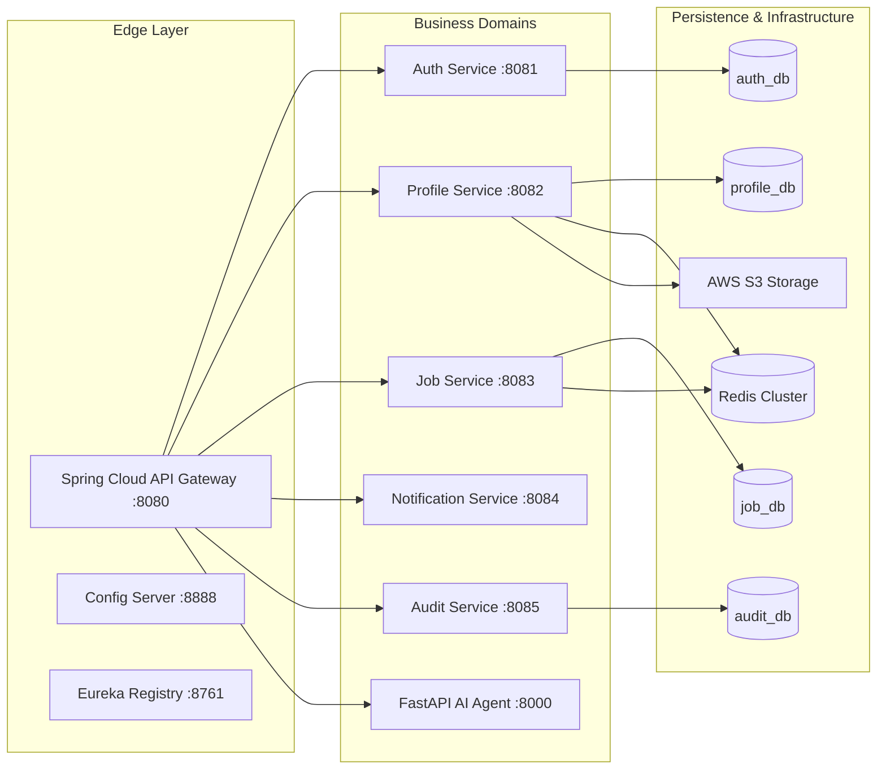
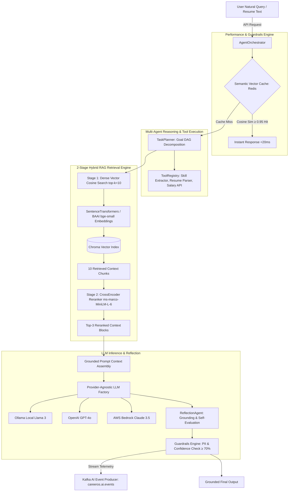
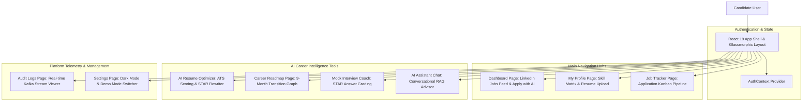

# 🚀 CareerOS — Enterprise AI-Powered Career & Job Platform

[](https://spring.io/projects/spring-boot)
[](https://www.oracle.com/java/)
[](https://fastapi.tiangolo.com/)
[](https://www.python.org/)
[](https://react.dev/)
[](https://www.docker.com/)
[](https://kafka.apache.org/)
[](https://www.rabbitmq.com/)
[](https://www.postgresql.org/)

**CareerOS** is an enterprise-grade, event-driven AI platform built with **10 Spring Boot 3 Java 21 microservices**, a **FastAPI Python 3.12 Multi-Agent AI Service**, a **2-Stage RAG Pipeline**, **Apache Kafka**, **RabbitMQ**, **Redis**, **PostgreSQL**, **ChromaDB**, and a **React 19 Frontend**.

---

## 1. Master System Architecture Blueprint

```mermaid
graph TD
    Client[React 19 Frontend :3000] -->|HTTPS REST / JWT| Gateway[Spring Cloud API Gateway :8080]
    Gateway -->|Eureka Discovery| Eureka[Eureka Service Registry :8761]
    
    subgraph Java Spring Boot Microservice Ecosystem
        Gateway --> Auth[Auth Service :8081]
        Gateway --> Profile[Profile Service :8082]
        Gateway --> Job[Job Service :8083]
        Gateway --> Notification[Notification Service :8084]
        Gateway --> Audit[Audit Service :8085]
        
        Profile -->|Read/Write| ProfileDB[(PostgreSQL - profile_db)]
        Job -->|Read/Write| JobDB[(PostgreSQL - job_db)]
        Auth -->|Read/Write| AuthDB[(PostgreSQL - auth_db)]
        Audit -->|Read/Write| AuditDB[(PostgreSQL - audit_db)]
        
        Profile -->|Cache| Redis[(Redis Cluster :6379)]
        Job -->|Cache| Redis
    end
    
    subgraph FastAPI Multi-Agent AI Microservice (:8000)
        Gateway -->|HTTP Routing /api/v1/ai| AIAgent[FastAPI Core Orchestrator]
        Job -->|Feign REST Client| AIAgent
        
        AIAgent --> Planner[TaskPlanner & ToolRegistry]
        AIAgent --> RAG[2-Stage RAG Pipeline]
        AIAgent --> SemanticCache[Vector Semantic Cache: Redis]
        
        RAG --> Embeddings[SentenceTransformers all-MiniLM-L6-v2]
        Embeddings --> Chroma[(Chroma Vector DB)]
        RAG --> CrossEncoder[CrossEncoder Reranker ms-marco-MiniLM-L-6]
        
        AIAgent --> LLMFactory[LLM Provider Factory]
        LLMFactory --> LocalOllama[Ollama Local Llama 3]
        LLMFactory --> OpenAI[OpenAI GPT-4o]
        LLMFactory --> Bedrock[AWS Bedrock Claude 3.5]
    end
    
    subgraph Event Streaming & Messaging Pipelines
        Auth -->|Publish USER_REGISTERED| Kafka[Apache Kafka :9092]
        Profile -->|Publish PROFILE_UPDATED| Kafka
        Job -->|Publish JOB_APPLIED| Kafka
        AIAgent -->|Publish AI_EVENTS| Kafka
        
        Kafka -->|Consume Events| Audit
        Kafka -->|Consume Notifications| Notification
        Notification -->|Queue Notifications| RabbitMQ[RabbitMQ :5672]
        Notification -->|SMTP Email Sandbox| Mailpit[Mailpit :8025]
    end
```

---

## 2. Microservice Ecosystem Architecture Diagram



---

## 3. Graphical Messaging Topology: Apache Kafka vs. RabbitMQ

```mermaid
graph TD
    subgraph Event Producers
        Auth[Auth Service]
        Profile[Profile Service]
        Job[Job Service]
        AI[AI Agent Service]
    end

    subgraph High-Throughput Event Streaming: Apache Kafka (:9092)
        TopicAuth[Topic: careeros.auth.events]
        TopicJob[Topic: careeros.job.events]
        TopicAI[Topic: careeros.ai.events]
        
        Auth --> TopicAuth
        Profile --> TopicAuth
        Job --> TopicJob
        AI --> TopicAI

        TopicAuth --> AuditConsumer[Audit Consumer: Audit Service]
        TopicJob --> AuditConsumer
        TopicAI --> AuditConsumer

        AuditConsumer --> DLQ[Kafka Dead Letter Queue .DLQ]
    end

    subgraph Reliable Task Queue: RabbitMQ (:5672)
        Exchange[Direct Exchange: careeros.notification.exchange]
        QueueEmail[Queue: careeros.notification.email.queue]
        DLXExchange[DLX: careeros.notification.dlx]
        
        Job -->|Trigger Email| Exchange
        Auth -->|Trigger Welcome Email| Exchange
        
        Exchange -->|Routing Key: notify.email| QueueEmail
        QueueEmail --> NotifConsumer[Notification Worker Service]
        QueueEmail -.->|Max Retries Exceeded| DLXExchange
        
        NotifConsumer --> Mailpit[Mailpit SMTP Sandbox :8025]
    end
```

---

## 4. AI Agent & 2-Stage RAG Pipeline Diagram



---

## 5. Graphical React 19 Frontend Page Architecture



---

## 6. Quick Start: Running the Full Stack

### **Option A: Run Full Stack with Docker Compose**
```bash
docker compose up -d --build
```
Dashboard endpoints:
- **React Frontend**: `http://localhost:3000`
- **Spring Cloud Gateway**: `http://localhost:8080`
- **FastAPI AI Agent OpenAPI Docs**: `http://localhost:8000/docs`
- **Eureka Service Registry**: `http://localhost:8761`
- **Kafka UI**: `http://localhost:8088`
- **Mailpit Email Sandbox**: `http://localhost:8025`

### **Option B: Run Services Locally for Development**
```bash
# 1. Package Java Microservices
cd Backend
.\mvnw.cmd clean package -DskipTests

# 2. Start FastAPI AI Agent
cd ../AI-Agent
py -m uvicorn app.main:app --reload --port 8000

# 3. Start React Frontend
cd ../Frontend
npm run dev
```

---

## 7. Master Documentation Architecture Files

- **[Master System Architecture Guide](file:///c:/Users/91741/Documents/Dream_NO.1/ARCHITECTURE.md)**
- **[AI Agent Master Architecture](file:///c:/Users/91741/Documents/Dream_NO.1/AI-Agent/ARCHITECTURE.md)**
- **[AI Agent Service Guide & Interview Q&A](file:///c:/Users/91741/Documents/Dream_NO.1/AI-Agent/SERVICE_GUIDE.md)**
- **[Job Service Architecture & Guide](file:///c:/Users/91741/Documents/Dream_NO.1/Backend/job-service/SERVICE_GUIDE.md)**
- **[Deployment & Production Operations](file:///c:/Users/91741/Documents/Dream_NO.1/DEPLOYMENT.md)**
